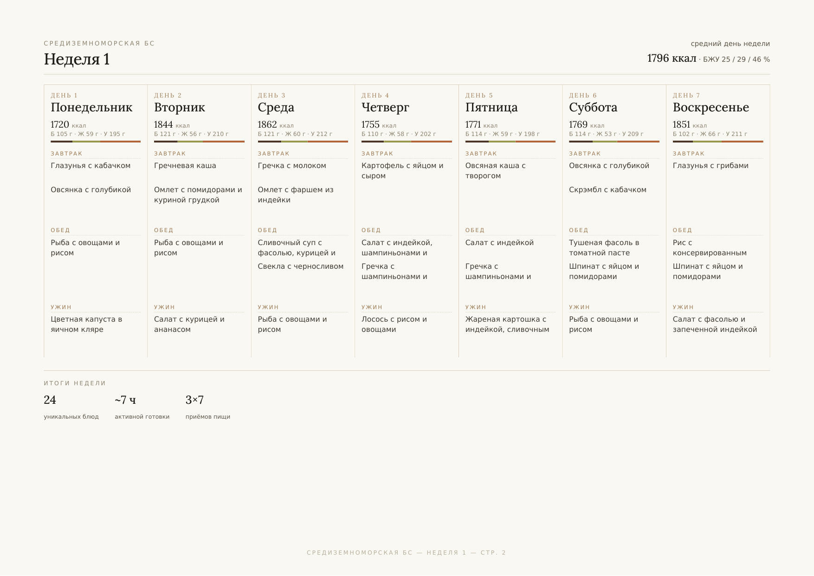
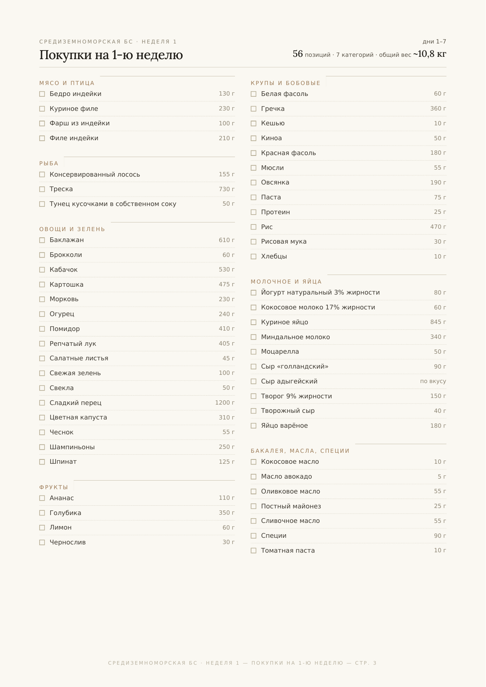
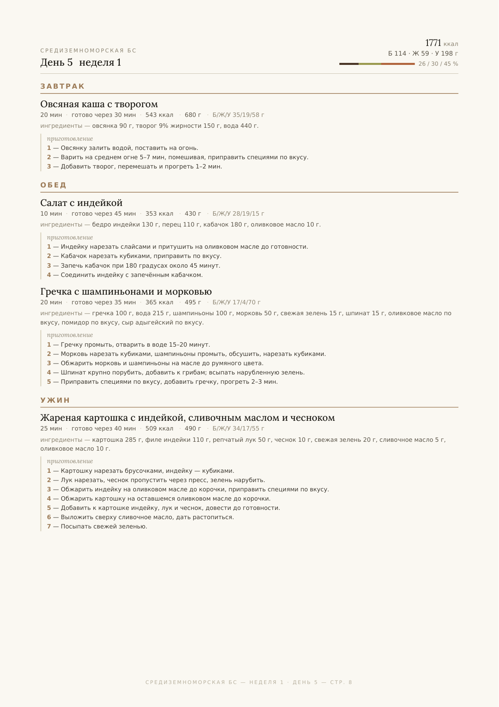

# PlanEat

**Персональные планы питания.** Клиент заполняет анкету — на выходе получает готовый
рацион на неделю: меню по дням с расчётом калорий и БЖУ, рецепты с граммовками
и пошаговым приготовлением, и список покупок, сведённый по категориям.

Это витрина проекта: описание продукта и примеры результата.
Исходный код и база рецептов не публикуются.

---

## Что решает

Составить рацион, который одновременно попадает в целевые калории и БЖУ, не нарушает
ограничения выбранного протокола питания, не повторяется всю неделю одними и теми же
блюдами и при этом собирается в вменяемый список покупок — вручную это часы работы
на одного клиента. PlanEat делает это автоматически и повторяемо.

## Что получает клиент

### Меню недели

Семь дней на одном развороте: каждый приём пищи, калорийность и БЖУ каждого дня,
итоги недели — сколько уникальных блюд и сколько времени уходит на активную готовку.

### Список покупок

Всё, что нужно купить на неделю, с весами и разбивкой по категориям —
чтобы за один поход по магазину закрыть весь план.

### День с рецептами

На каждый день — состав каждого блюда в граммах, время активной готовки
и время до готовности, КБЖУ порции и пошаговый рецепт.

**[Скачать пример целиком (PDF)](example/planeat-example.pdf)** — те же три страницы одним файлом.

---

## Охват

| | |
|---|---|
| Протоколы питания | 17 — средиземноморская, веганская, палео, АИП, LCHF, безглютеновая/безказеиновая, LOW FODMAP, антикандида и другие |
| Приёмов пищи в день | от 3 или до 6 |
| Калорийность и БЖУ | задаются под клиента |
| Персональные ограничения | непереносимости и аллергии, нелюбимые продукты, доступное кухонное оборудование |
| Горизонт | неделя или месяц |

Каждый протокол — это не просто ярлык: под ним лежит проверяемый список того, что
в нём запрещено, и план проверяется на соответствие перед выдачей.

---

## Статус

Рабочий продукт: планы генерируются и выдаются клиентам. Развивается.

## Права

© 2026 PlanEat. Все права защищены.
Материалы опубликованы для ознакомления. Рецепты, тексты и оформление —
собственность проекта; использование без разрешения не допускается.
